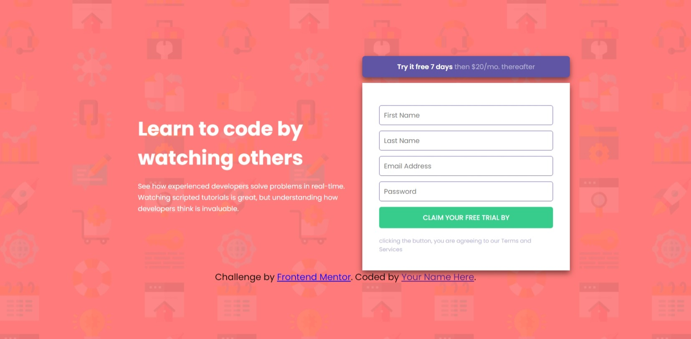
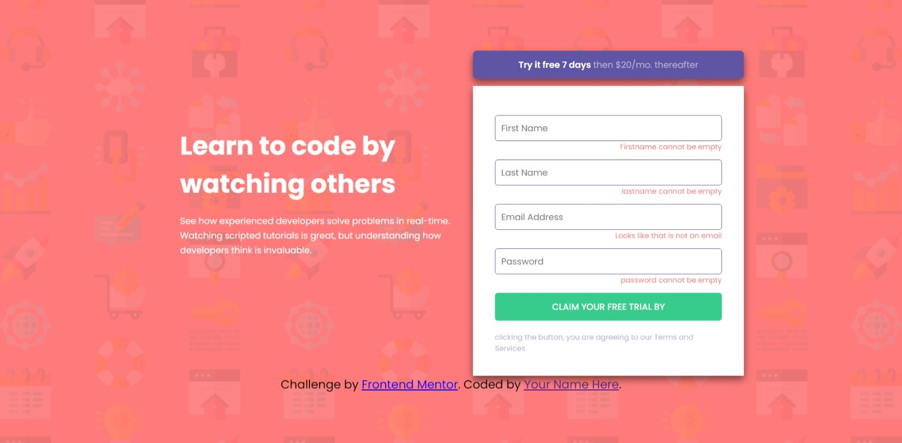
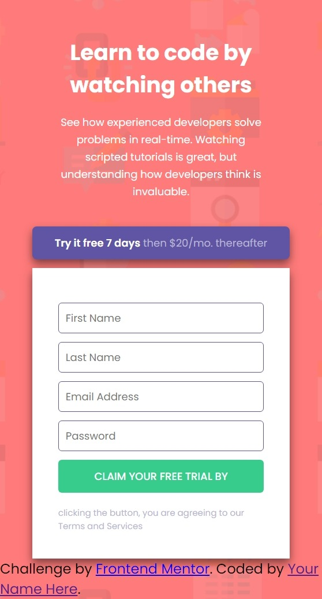

# Frontend Mentor - Intro component with sign up form solution

This is a solution to the [Intro component with sign up form challenge on Frontend Mentor](https://www.frontendmentor.io/challenges/intro-component-with-signup-form-5cf91bd49edda32581d28fd1). Frontend Mentor challenges help you improve your coding skills by building realistic projects.

## Table of contents

- [Overview](#overview)
  - [The challenge](#the-challenge)
  - [Screenshot](#screenshot)
  - [Links](#links)
- [My process](#my-process)
  - [Built with](#built-with)
  - [What I learned](#what-i-learned)
  - [Continued development](#continued-development)
  - [Useful resources](#useful-resources)
- [Author](#author)
- [Acknowledgments](#acknowledgments)

**Note: Delete this note and update the table of contents based on what sections you keep.**

## Overview

### The challenge

Users should be able to:

- View the optimal layout for the site depending on their device's screen size
- See hover states for all interactive elements on the page
- Receive an error message when the `form` is submitted if:
  - Any `input` field is empty. The message for this error should say _"[Field Name] cannot be empty"_
  - The email address is not formatted correctly (i.e. a correct email address should have this structure: `name@host.tld`). The message for this error should say _"Looks like this is not an email"_

### Screenshot





Add a screenshot of your solution. The easiest way to do this is to use Firefox to view your project, right-click the page and select "Take a Screenshot". You can choose either a full-height screenshot or a cropped one based on how long the page is. If it's very long, it might be best to crop it.

Alternatively, you can use a tool like [FireShot](https://getfireshot.com/) to take the screenshot. FireShot has a free option, so you don't need to purchase it.

Then crop/optimize/edit your image however you like, add it to your project, and update the file path in the image above.

### Links

- Solution URL: [https://github.com/winsofttutorials/intro-component-with-signup-form-master.git]
- Live Site URL: [Add live site URL here](https://your-live-site-url.com)

## My process

Approach designing the structure before going into implementing its functionality

### Built with

- Semantic HTML5 markup
- CSS custom properties
- Flexbox
- CSS Grid
- Mobile-first workflow
- [React](https://reactjs.org/) - JS library
- [Next.js](https://nextjs.org/) - React framework
- [Styled Components](https://styled-components.com/) - For styles

### What I learned

I used this project to get my head working again on form input validation, HTML and CSS component structuring.
To see how you can add code snippets, see below:

```html
<div class="formframe">
  <form>
    <div>
      <input type="text" placeholder="First Name" id="fsname" />
      <p id="fname"></p>
    </div>
    <div>
      <input type="text" placeholder="Last Name" id="lsname" />
      <p id="lname"></p>
    </div>
    <div>
      <input type="email" placeholder="Email Address" id="mails" />
    </div>
  </form>
</div>
```

```css
.formframe {
  background-color: #fff;
  padding: 30px;
  box-shadow: 0 5px 10px rgba(0, 0, 0, 0.5);

```

```js
// function validate() {
//         if (
//           !email.value.match(/^[A-za-z\._\-0-9]*[@][A-Za-z]*[\.][a-z]{2,4}$/) &&
//           !firstname.value.match(/^[A-za-z\._\-0-9]*[A-Za-z]*[a-z]$/) &&
//           !lastname.value.match(/^[A-za-z\._\-0-9]*[A-Za-z]*[a-z]$/) &&
//           !password.value.match(/^[A-za-z\._\-0-9]*[@][A-Za-z]*[a-z]{2,6}$/)
//         ) {
```

If you want more help with writing markdown, we'd recommend checking out [The Markdown Guide](https://www.markdownguide.org/) to learn more.

### Continued development

Use this section to outline areas that you want to continue focusing on in future projects. These could be concepts you're still not completely comfortable with or techniques you found useful that you want to refine and perfect.

### Useful resources

- [Example resource 1](https://www.example.com) - This helped me for XYZ reason. I really liked this pattern and will use it going forward.
- [Example resource 2](https://www.example.com) - This is an amazing article which helped me finally understand XYZ. I'd recommend it to anyone still learning this concept.

## Author

- Website - [](https://www.your-site.com)
- Frontend Mentor - [@winsofttutorials]
- Twitter - [@IFIDIKUROEPHOD]

## Acknowledgments

A special appreciation to my mentor @GreatStack he is indeed a greatstack and an embodiment of wisdom. Thank you for all you do.
